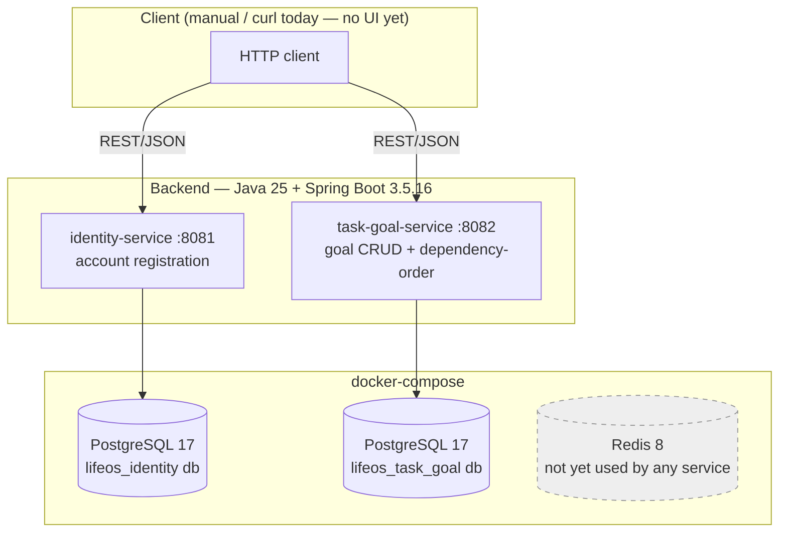

# Current Architecture Diagram

This reflects what is actually running today, not the full target architecture in `REQUIREMENTS.md`'s "High-Level Architecture" section. See [`docs/architecture/current-state.md`](../architecture/current-state.md) for the narrative version and the gap to the target design.

Redis is drawn dashed because it runs in `docker-compose` but no service code uses it yet — see [`why-redis.md`](../interview/why-redis.md).

## Target architecture (not yet built)

`REQUIREMENTS.md`'s "Core Microservices" section names 13 services total; Identity and Task/Goal are the 2 built so far, leaving 11 not yet started: API Gateway, Profile, Calendar, Finance, Document Vault, Media Streaming, AI Orchestrator, Algorithm Engine, Blockchain Trust Ledger, Notification, and Analytics. (A `search-service/` also appears in REQUIREMENTS.md's high-level directory-tree diagram, but it isn't one of the 13 named in the Core Microservices section itself, so it's not counted here.) The event bus (Kafka/Pulsar), GraphQL/gRPC layers, and the Angular/JavaFX/Flutter clients are all planned but not implemented either. This diagram will be extended as each phase of `REQUIREMENTS.md`'s "Suggested MVP Roadmap" lands, rather than drawn speculatively ahead of the code.
