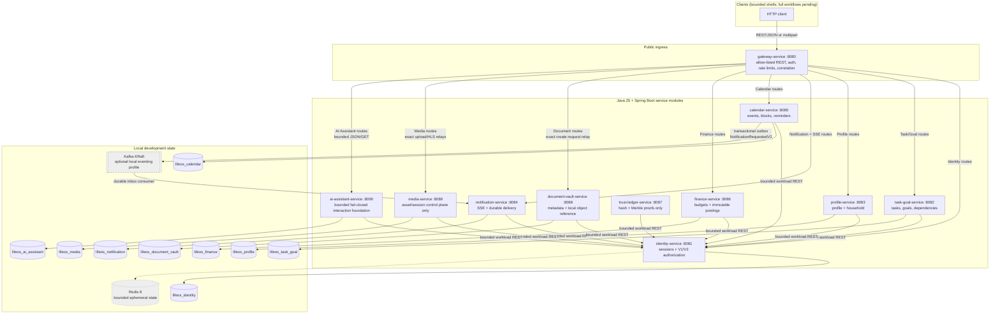

# Current Architecture Diagram

This diagram reflects repository-verified implementation, not a production deployment claim. See
[the current-state narrative](../architecture/current-state.md) for precise implemented-versus-pending
scope.

The dashed Redis and Kafka nodes are optional, localhost-bound development infrastructure rather
than durable product source-of-truth databases. Redis carries bounded rate-limit/authentication
state; Kafka currently carries the narrow Calendar-to-Notification CloudEvents path. PostgreSQL is
the system of record for each shown stateful bounded context.

Trust Ledger has no public gateway prefix yet: its bounded proof APIs can be exercised directly in
the current foundation, but are not a claim of a production perimeter. It deliberately reports no
Besu/Web3j anchor as complete. Document Vault's production object-store adapter also remains
unimplemented and fails closed; the local object reference in the diagram is not a production
object-store deployment. Media's public asset/session control plane is gateway-routed, but its
production object-store, HLS worker, and WebRTC/SFU adapters intentionally fail closed. AI
Assistant has a public gateway prefix but deliberately fails closed without a reviewed model
provider and registered Identity workload token; it is not a live AI/RAG deployment.

The following remain outside the current diagram: Analytics, GraphQL, live gRPC/mTLS transport,
production Kafka/provider/ledger operations, and Angular/JavaFX/Flutter
clients. They are target architecture or work-in-progress modules, not verified deployed paths.
