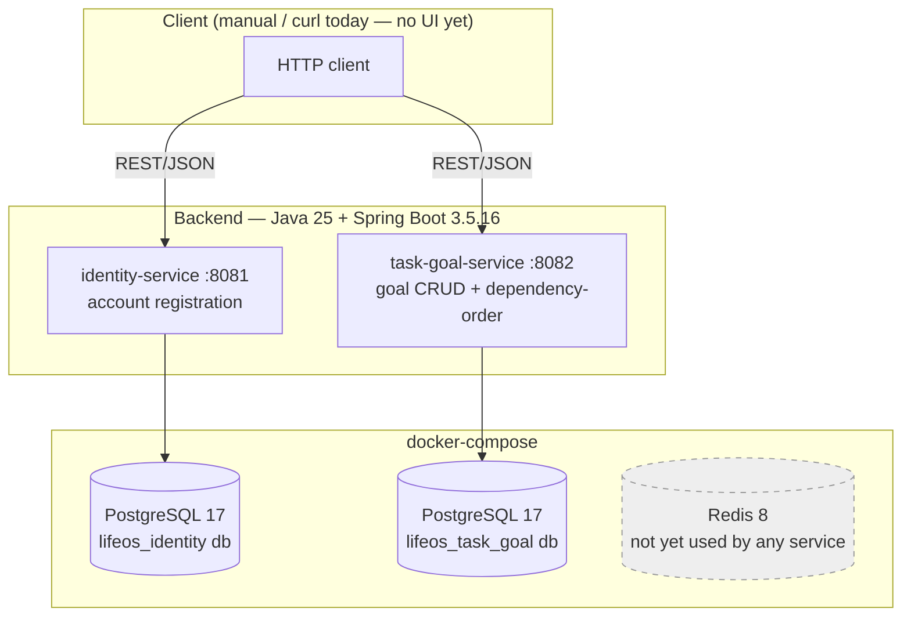

# Current Architecture Diagram

This reflects what is actually running today, not the full target architecture in [REQUIREMENTS.md](../../REQUIREMENTS.md#high-level-architecture). See [`docs/architecture/current-state.md`](../architecture/current-state.md) for the narrative version and the gap to the target design.

Redis is drawn dashed because it runs in `docker-compose` but no service code uses it yet — see [`why-redis.md`](../interview/why-redis.md).

## Target architecture (not yet built)

The full 13-service architecture (API Gateway, Profile, Calendar, Finance, Document Vault, Media Streaming, AI Orchestrator, standalone Algorithm Engine, Blockchain Trust Ledger, Notification, Analytics, Search — see [REQUIREMENTS.md § Core Microservices](../../REQUIREMENTS.md#core-microservices)), the event bus (Kafka/Pulsar), GraphQL/gRPC layers, and the Angular/JavaFX/Flutter clients are all planned but not implemented. This diagram will be extended as each phase of the [MVP roadmap](../../REQUIREMENTS.md#suggested-mvp-roadmap) lands, rather than drawn speculatively ahead of the code.
