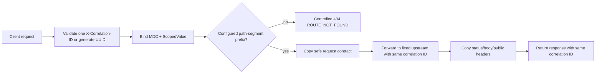

# Epic 2 gateway — Story 2.1

The gateway owns a finite deployment configuration of versioned public path prefixes. A request
cannot select an arbitrary upstream, and a downstream response cannot replace the request's
validated correlation ID.



Current routes:

```text
/api/v1/accounts -> identity-service
/api/v1/auth     -> identity-service
/api/v1/goals    -> task-goal-service
```

The route table is materialized once at startup and resolved by path-segment prefixes. Resolution is
bounded by the request path length and does not perform I/O. Request and response bodies are buffered
only under configured byte limits; connection and read deadlines turn transport failures into generic
502/504 responses. Authentication, rate limiting, circuit breaking, and bulkheads are deliberately
left to Stories 2.2 and 2.3.
