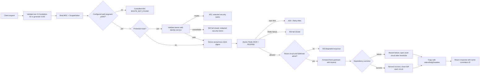

# Epic 2 gateway — Stories 2.1–2.3

The gateway owns a finite deployment configuration of versioned public path prefixes. A request
cannot select an arbitrary upstream, and a downstream response cannot replace the request's
validated correlation ID.



Current routes:

```text
/api/v1/accounts -> identity-service
/api/v1/auth     -> identity-service
/api/v1/auth/sessions -> identity-service (protected)
/api/v1/goals    -> task-goal-service (protected)
```

The route table is materialized once at startup and resolved by path-segment prefixes. Resolution is
bounded by the request path length and does not perform I/O. Request and response bodies are buffered
only under configured byte limits; connection and read deadlines turn transport failures into generic
502/504 responses. Protected routes call identity-service's workload-authenticated validation
adapter before request-body forwarding. The gateway forwards only bounded subject facts and strips
caller-supplied subject/workload headers. Identity-owned account/auth prefixes remain explicitly
public at the gateway where bootstrap operations require it; account lookup and session management
are protected by more-specific gateway policies. Identity-service still enforces its operation-level
rules. Story 2.3 adds Redis-backed route/client budgets plus per-route non-waiting upstream
bulkheads and circuit breakers; the gateway's identity-validation bulkhead is implemented as part
of Story 2.2.
