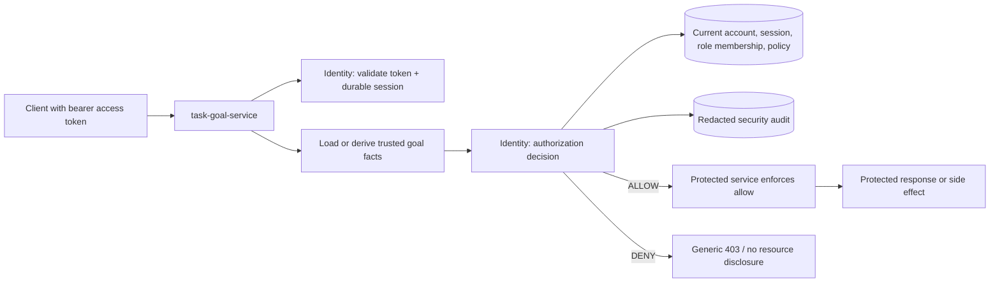
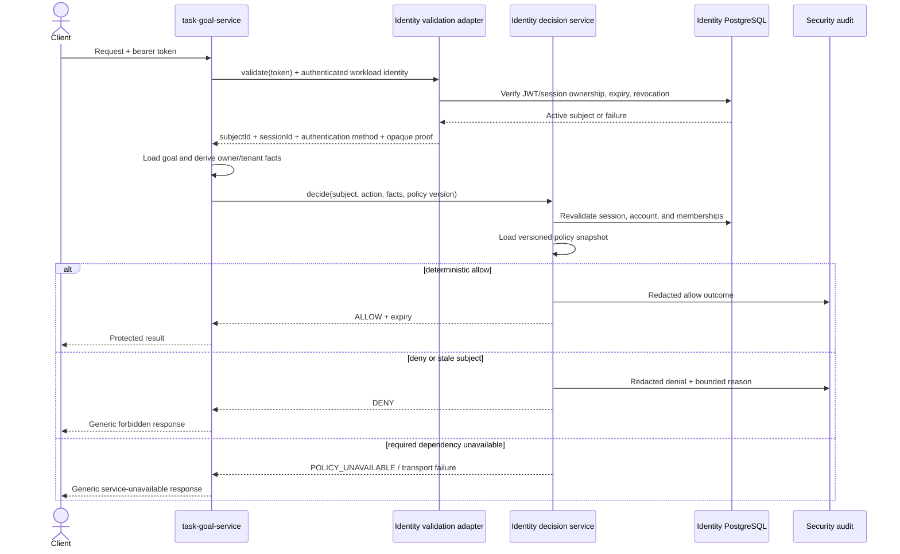
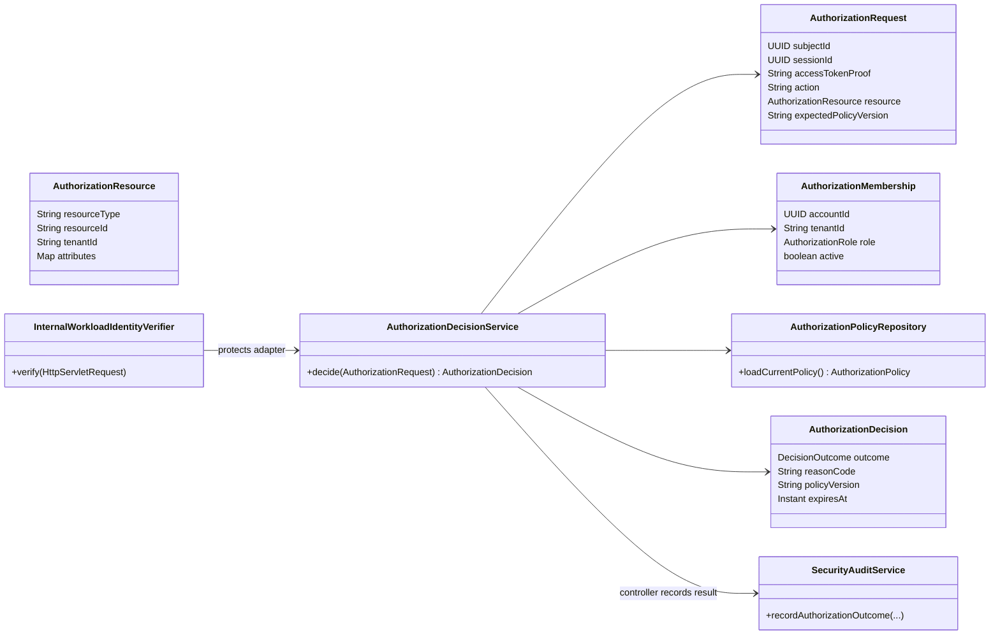
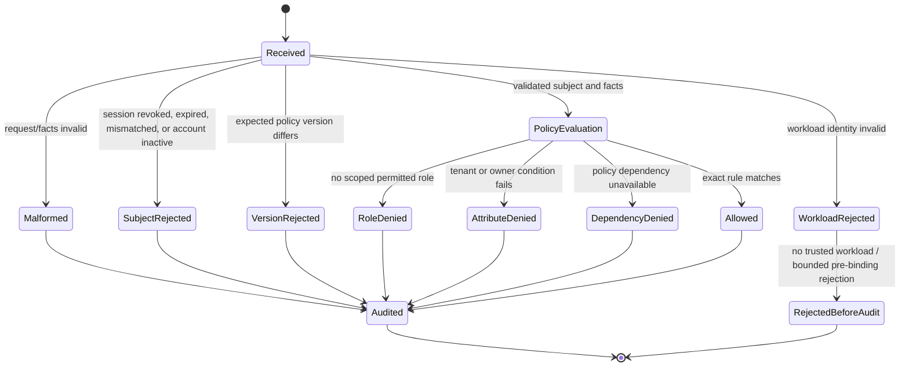

# Story 1.6 — RBAC and ABAC authorization decisions

This document is the source of truth for the implemented authorization-decision boundary in
Story 1.6 (#134). It complements the authentication and session model in
[ADR-020](../adr/ADR-020-use-identity-service-for-multi-mode-authentication-and-session-management.md).

## Scope and decision

The identity service owns policy semantics, current role membership, active-account checks, and
durable session revalidation. A protected service owns its resource lookup and supplies only the
facts it loaded itself; it must enforce the returned decision before returning data or applying a
side effect.

The first protected vertical slice is `task-goal-service`. New goals have an owner account and
tenant. Every goal create/list/read/dependency-order operation validates the bearer token through
identity and requests an object-level decision. Creation derives the owner and tenant from the
validated subject, never from client JSON. Missing and cross-user goal reads use the same generic
denial response, so the API does not disclose resource existence.

The repository does not yet contain the `grpc-contracts` module required by ADR-007. The current
adapter is therefore a deliberately narrow internal REST/JSON bridge with versioned DTOs, bounded
connect/read timeouts, and authenticated workload headers. This is not a claim that mTLS or gRPC
has already been deployed: production infrastructure must restrict this route to service traffic
and enforce TLS/mTLS or an equivalent workload-identity control. The decision domain is independent
of the adapter so it can move to generated gRPC contracts without changing policy semantics.



## Decision contract

`POST /api/v1/internal/authorization/decisions` accepts a versioned request from an authenticated
workload. Before Spring binds JSON, a servlet filter verifies the workload identity, charges its
separate distributed request budget, and limits the body to 16 KiB. An unauthenticated caller never
causes an unbounded attributes-map allocation or a durable audit write. The protected service then
supplies the subject, session, and opaque validation proof returned by the immediately preceding
validation call, an exact action, and resource facts from its database:

```json
{
  "subjectId": "5e7af000-0000-4000-8000-000000000001",
  "sessionId": "7a4cf000-0000-4000-8000-000000000002",
  "accessTokenProof": "<opaque internal proof, redacted>",
  "action": "goal:read",
  "resource": {
    "resourceType": "goal",
    "resourceId": "f65bf000-0000-4000-8000-000000000003",
    "tenantId": "5e7af000-0000-4000-8000-000000000001",
    "attributes": {
      "ownerAccountId": "5e7af000-0000-4000-8000-000000000001",
      "resourceExists": "true"
    }
  },
  "expectedPolicyVersion": "v1"
}
```

The response contains only a deterministic decision, bounded reason code, policy version, and an
expiry no later than the active session deadline. It never contains a resource payload, resource
existence flag, bearer token, or raw policy record.

```json
{
  "outcome": "ALLOW",
  "reasonCode": "ALLOWED",
  "policyVersion": "v1",
  "expiresAt": "2026-08-13T18:10:00Z"
}
```

Malformed facts, unknown actions, stale subjects, missing roles, tenant failures, owner failures,
and policy-version mismatches are deny-by-default. A policy-store or audit dependency failure can
never produce an allow. The protected-service adapter maps `POLICY_UNAVAILABLE` and transport
failures to generic `503`; other denials are generic `403` responses without target-specific detail.
Only a subject proven by the durable session check is attached to an audit row; malformed or stale
requests are audit-recorded with no account identifier rather than a caller-supplied UUID.

## Initial policy (`v1`)

| Action | RBAC requirement | ABAC requirement |
| --- | --- | --- |
| `goal:create` | `MEMBER` or `TENANT_ADMIN` in scope | Tenant is the subject's personal tenant and `ownerAccountId` equals the subject |
| `goal:list` | `MEMBER` or `TENANT_ADMIN` in scope | Collection belongs to the scoped tenant; attributes are empty |
| `goal:read` | `MEMBER` or `TENANT_ADMIN` in scope | A protected service must prove `resourceExists=true`; `MEMBER` must own the resource; `TENANT_ADMIN` may read another owner only in its scoped tenant |
| `goal:dependency-order` | `MEMBER` or `TENANT_ADMIN` in scope | Collection belongs to the scoped tenant; attributes are empty |

Every account has an implicit `MEMBER` role for its personal tenant (its account UUID string).
Durable, active `AuthorizationMembership` records can grant scoped roles such as `TENANT_ADMIN`.
There is intentionally no unbounded role scan or free-form policy expression: selected role rules
and the small resource attribute map evaluate in `O(r + a)` time, where `r` is selected roles and
`a` is policy-relevant attributes. Membership lookup is indexed by account and tenant.

## Request sequence



## Domain view



## Decision lifecycle



## Security, reliability, and observability invariants

- A signed JWT alone is never enough. Identity rechecks the durable session before validation and
  before the authorization decision, so a stale or revoked subject cannot gain access from claims.
- RBAC never bypasses ABAC. A role is evaluated together with tenant and owner/resource facts.
- The caller may not supply its own owner, tenant, or existence fact. `task-goal-service` loads
  persisted facts and creation derives them from the validated subject. An absent or ownerless row
  is sent as `resourceExists=false`, which the authority denies and audits as a bounded
  object-level denial before the service returns the same generic response.
- Task/Goal never holds its database transaction open across an identity network call. It loads
  immutable authorization facts, asks for the durable decision with bounded timeouts, then performs
  its repository operation in a separate local transaction. This avoids tying up database
  connections during a dependency outage; the decision is deliberately immediately before the
  protected side effect because no cross-service transaction can make a later revocation atomic.
- Workload identity is separately authenticated and has a Redis-backed, bounded per-workload
  request budget. It is independent of the credential-login limiter so normal protected-service
  traffic is not accidentally throttled at five attempts per minute. The decision endpoint verifies
  it before JSON binding and caps its body at 16 KiB. Missing configuration, unknown workloads,
  wrong credentials, malformed bearer input, network errors, invalid identity JSON, and
  policy/audit/rate-limit failures have no permissive fallback. Unauthenticated workload failures
  do not synchronously persist audit rows, because that would create a database-exhaustion path;
  durable authorization outcomes are audited after workload authentication.
- Audit rows contain an event category, subject when known, server-generated correlation ID, keyed
  client fingerprint, and bounded outcome code. They never contain tokens, workload credentials,
  resource IDs, resource contents, tenant values, or arbitrary attributes.
- `identity_authorization_decisions_total` uses only bounded outcome/reason dimensions. Account,
  session, resource, tenant, and token values are never metric labels.
- The initial implementation intentionally has no decision cache. A future cache must be bounded,
  expire no later than the session, and key on subject, session, action, resource, tenant, policy
  version, and all policy-relevant facts. Cache loss or errors must never create an allow.

## Validation matrix

| Scenario | Expected result |
| --- | --- |
| Member reads own goal in personal tenant | Allow |
| Missing role or tenant membership | Deny and audit |
| Owner attribute differs from subject | Deny and audit |
| Different user or missing goal read denied by policy | Same generic `403` response body |
| Revoked, expired, session-mismatched, or disabled subject | Deny and audit |
| Policy-version mismatch or unknown action | Deterministic deny |
| Admin reads another owner in explicitly scoped tenant | Allow at policy boundary |
| Policy/audit/transport failure | No allow; generic `503` at protected-service boundary |

Decision-table tests are deterministic and independent of network timing. HTTP-adapter tests verify
bounded workload headers, validation response shape, generic errors, and Task/Goal two-user isolation.
