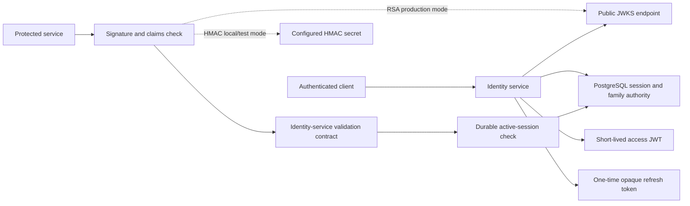
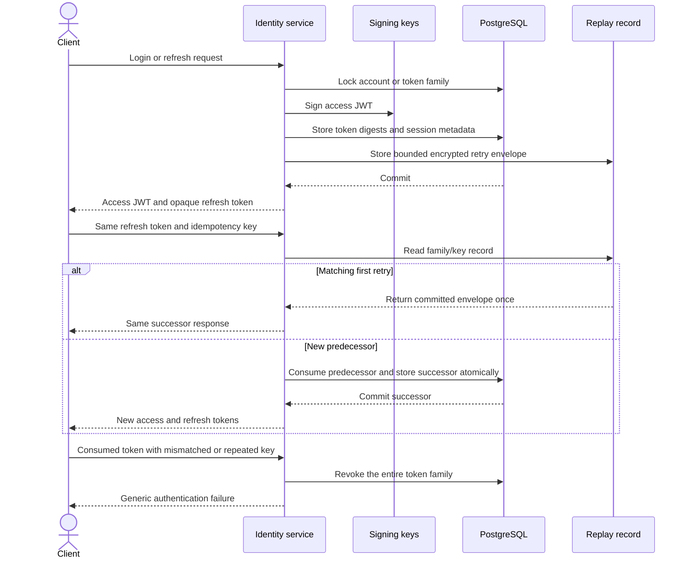
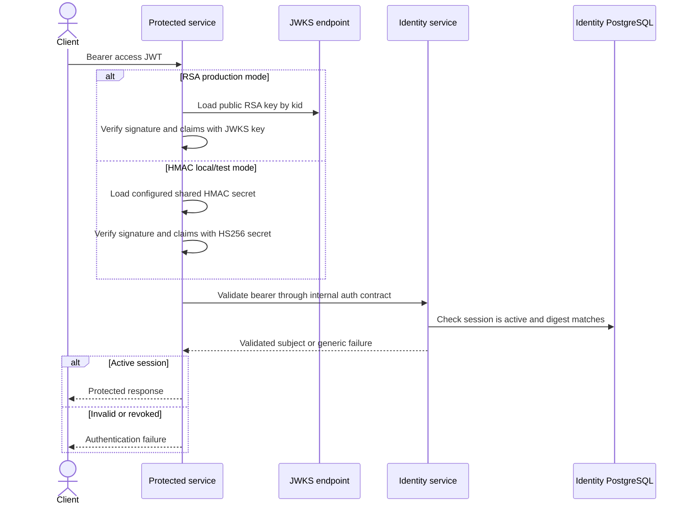
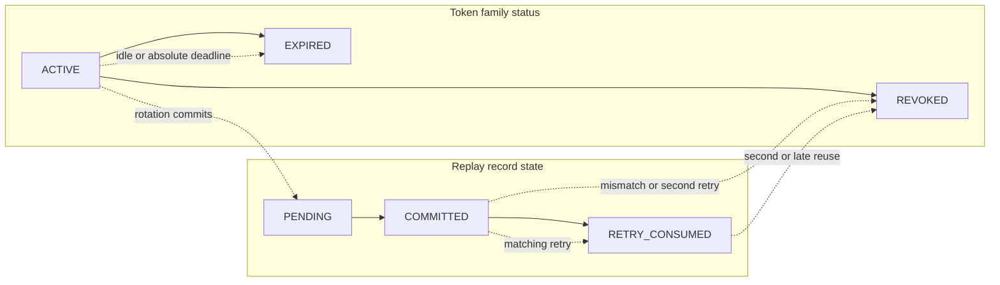

# Story 1.5 — JWT issuance and refresh rotation

This document is the repository source of truth for the implemented Story 1.5 token contract. The
identity service issues short-lived access JWTs and high-entropy opaque refresh tokens. PostgreSQL
holds the durable session and token-family authority; Redis is not required for correctness.

## Token boundary

## Issuance and rotation

## Protected-request validation

## Token-family lifecycle

## Invariants

- JWTs use the configured issuer and audience, a stable subject and session id, an explicit
  authentication-method claim, and a bounded five-minute default expiry.
- Access-token and refresh-token values are never persisted in raw form. Only SHA-256 digests are
  stored; the one retry response is encrypted before it is persisted and expires after 30 seconds.
- A pessimistic family-row lock plus one conditional predecessor consumption gives one rotation
  linearization point. A mismatched replay revokes the family instead of minting another successor.
- JWT verification is only an early filter. Protected data requires an active durable session check,
  and a revoked session remains rejected after cache loss or restart.
- Family, session, and token-digest lookups use the declared database indexes; replay evidence is
  bounded per family. Deadline checks bound retry eligibility and replay-expiry checks, but do not
  delete expired `RefreshReplayRecord` rows from the database.

## Operational trade-offs

Asymmetric RSA signing and JWKS publication are the production configuration. The prior HMAC
configuration remains only as a local/test compatibility path and does not publish a symmetric key.
The database lock adds a bounded write round trip to refresh, but it makes concurrent reuse
deterministic and auditable. A configured replay-record bound revokes the family rather than
silently evicting evidence.
