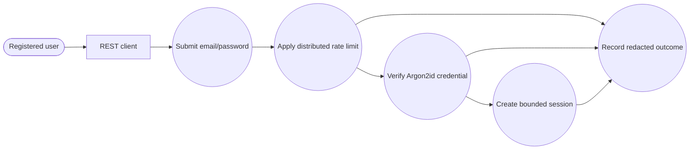
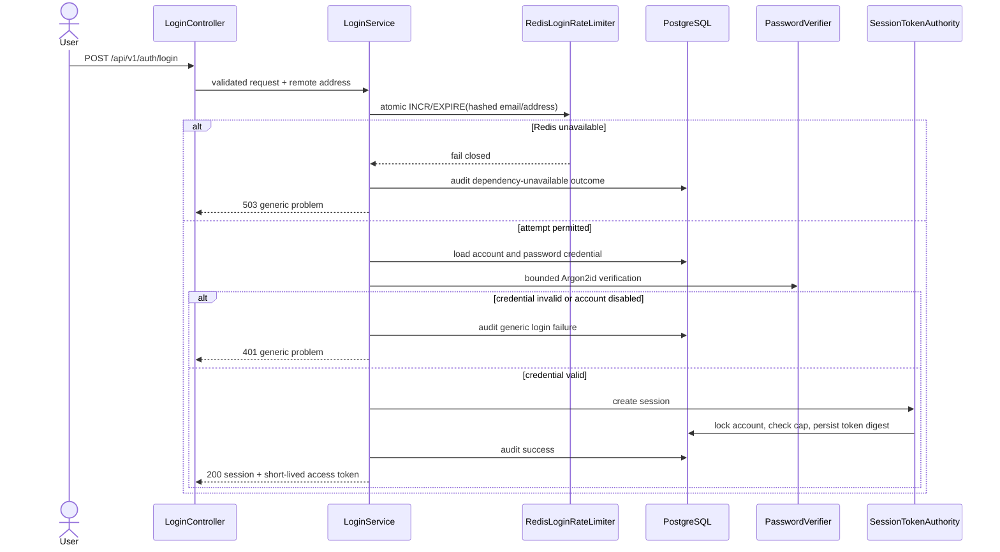
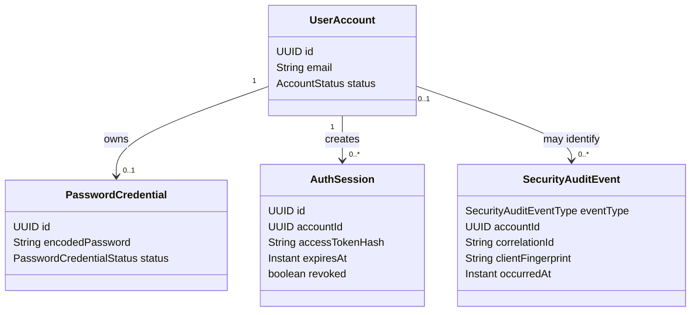
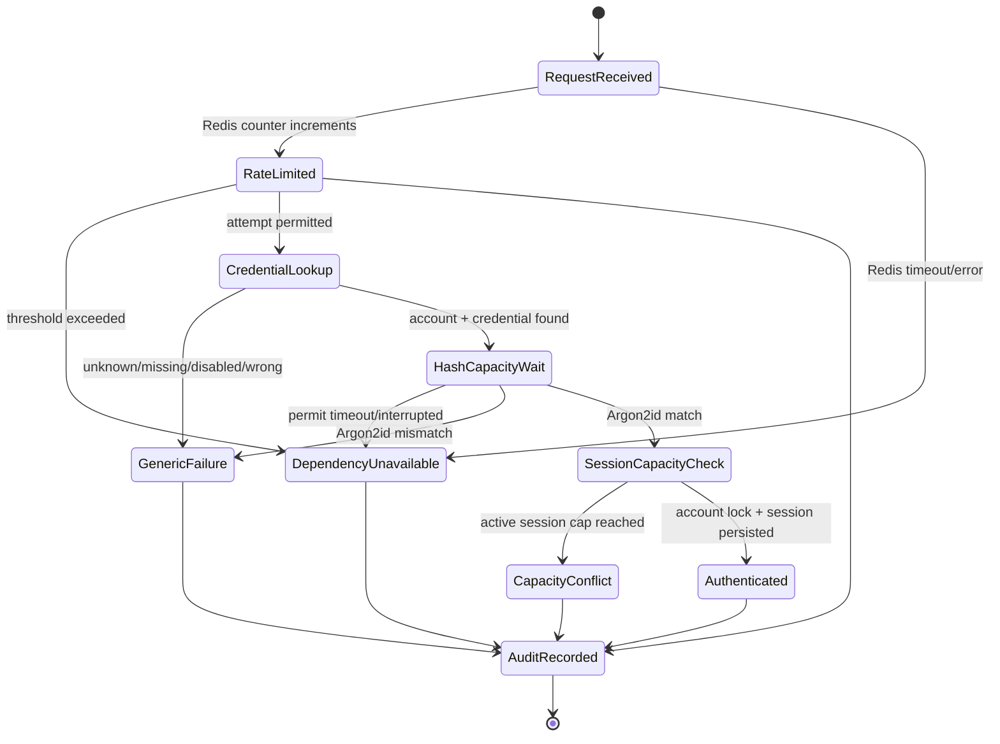

# Story 1.2 — First-party login diagrams

These diagrams describe the implemented `POST /api/v1/auth/login` flow. The identity service is
the policy and session authority; PostgreSQL is the durable store, while Redis is limited to
distributed attempt counters. Refresh-token rotation, asymmetric signing/JWKS, and user-facing
session revocation remain Story 1.5 scope.

## Use-case view

## Sequence view

## Domain/class view

## State view

## Invariants

- Credential failures use one public error shape and do not disclose account existence.
- Raw passwords, bearer tokens, email addresses, and raw network addresses are not logged or
  persisted by the authentication path.
- Redis and local Argon2 capacity failures fail closed; no in-process rate-limit fallback exists.
- Session creation locks the account capacity row and stores only a SHA-256 access-token digest.
- Every security outcome is correlated and written to the redacted audit table when persistence is
  available.
