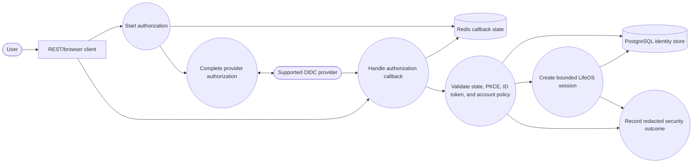
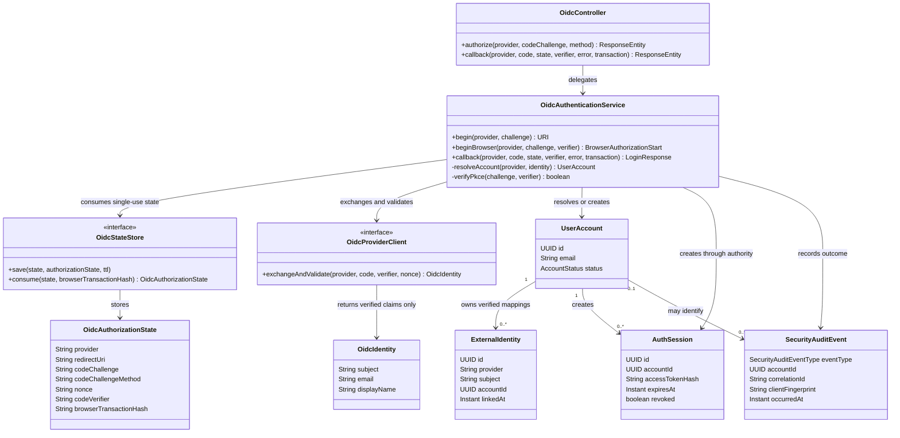
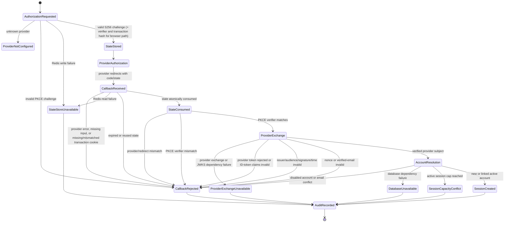

# Story 1.3 — OAuth2/OIDC login diagrams

These diagrams describe the implemented authorization-code flow at
`/api/v1/auth/oidc/{provider}/authorize` and
`/api/v1/auth/oidc/{provider}/callback`. The identity service is the provider allow-list,
callback, account-linking, audit, and LifeOS session authority. Redis stores only short-lived,
single-use callback state. Browser starts also receive a short-lived, host-only browser
transaction cookie; Redis stores only its SHA-256 hash. PostgreSQL stores the verified
external-identity mapping and durable session metadata.

## Use-case view



## Sequence view

```mermaid
sequenceDiagram
    actor User
    participant Client as REST/browser client
    participant API as OidcController
    participant Cookie as Browser transaction cookie
    participant App as OidcAuthenticationService
    participant Redis as RedisOidcStateStore
    participant Provider as OIDC provider
    participant DB as PostgreSQL
    participant Authority as SessionTokenAuthority

    User->>Client: Choose supported provider
    Client->>API: POST /authorize + S256 challenge + verifier
    API->>App: provider + challenge + verifier
    App->>Redis: SET state(provider, challenge, nonce, verifier, transaction hash) EX 5m
    alt Redis unavailable
        Redis-->>App: fail closed
        App-->>API: 503 generic problem
    else state stored
        API-->>Client: 302 provider URI + Set-Cookie transaction
        Client->>Cookie: Store HttpOnly, Secure, SameSite=Lax transaction
        Client->>Provider: Authorize with state, nonce, and PKCE challenge
        Provider-->>API: Redirect code + state
        Cookie-->>API: matching transaction cookie
        API->>App: callback parameters + transaction + client address
        Note over API,App: Browser path recovers verifier from server state and requires its matching transaction cookie; private clients use the callback header
        App->>Redis: atomic GET + transaction-hash compare + DEL state
        alt state expired, reused, mismatched, or transaction-bound to another browser
            Redis-->>App: empty or invalid state
            App->>DB: audit callback-rejected outcome
            App-->>API: 401 generic OIDC problem
        else state consumed and PKCE matches
            App->>Provider: Exchange code + verifier
            Provider-->>App: ID token and provider token response
            App->>App: Validate signature, issuer, audience, nonce, and email_verified
            alt provider claims invalid or email conflict
                App->>DB: audit callback-rejected outcome
                App-->>API: 401 generic OIDC problem
            else verified provider subject
                App->>DB: find or create external identity mapping
                App->>Authority: createSession(account, OIDC)
                Authority->>DB: lock account, check cap, persist token digest
                App->>DB: audit success in session transaction
                App-->>API: 200 shared session + short-lived access token
            end
        end
    end
```

## Domain/class view



## State view



## Invariants

- Only explicitly configured providers, issuer endpoints, client IDs, client credentials, JWKS
  URIs, and callback URIs are usable; provider transport is HTTPS, with loopback HTTP allowed only
  for local callbacks.
- Callback state is short-lived and atomically consumed. Expired, reused, provider-mismatched,
  transaction-mismatched, or PKCE-mismatched callbacks cannot reach provider exchange, account
  linking, or session creation.
- Browser authorization starts retain the client-generated verifier only in short-lived,
  single-use server state. They are bound to a 256-bit transaction value held in a Secure,
  HttpOnly, `SameSite=Lax` cookie. Redis retains only the transaction's SHA-256 hash and deletes
  state atomically only after that hash matches. The verifier and transaction are never appended
  to the provider redirect URI.
- ID tokens must pass signature and time validation plus exact issuer, configured audience, matching
  nonce, and `email_verified=true` checks. Provider access and refresh tokens are never persisted or
  returned to downstream LifeOS services.
- A new verified provider email may create a new LifeOS account. A matching email on an existing
  unlinked account is rejected; email equality alone never authorizes account takeover or linking.
- OIDC sessions use the shared session authority and durable session-capacity checks, without
  requiring a local password credential. Raw tokens, callback state, email addresses, and provider
  claims are not written to audit logs.
- Every callback rejection, dependency failure, capacity conflict, and successful OIDC session is
  recorded as a redacted security audit event with correlation and keyed client-fingerprint data
  when the audit store is available. If audit persistence itself fails, the service logs the
  operational failure and returns a generic temporary-failure response; no audit row can be
  claimed for that failure without a separate fallback sink.
- A callback code and state copied to another browser cannot consume browser-bound state without
  the initiating browser's transaction cookie. The callback cookie is host-only, scoped to the
  OIDC path, and cleared after a successful callback. Private clients requiring client-held PKCE
  proof use the legacy GET start and the `X-PKCE-Code-Verifier` callback header instead.
