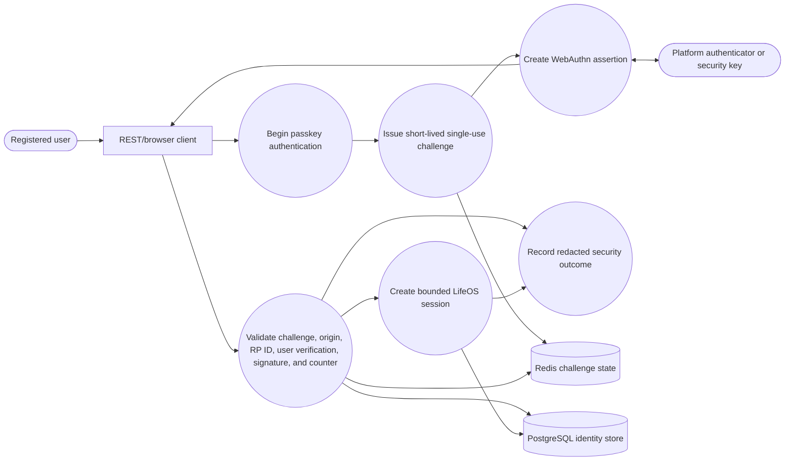
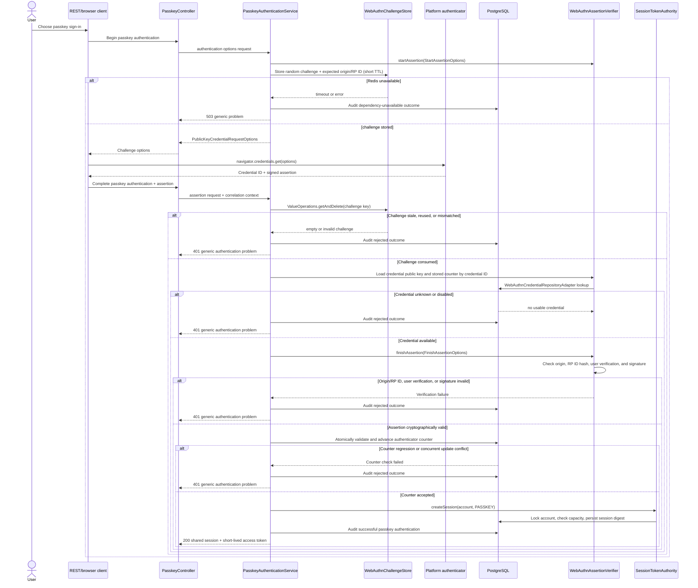
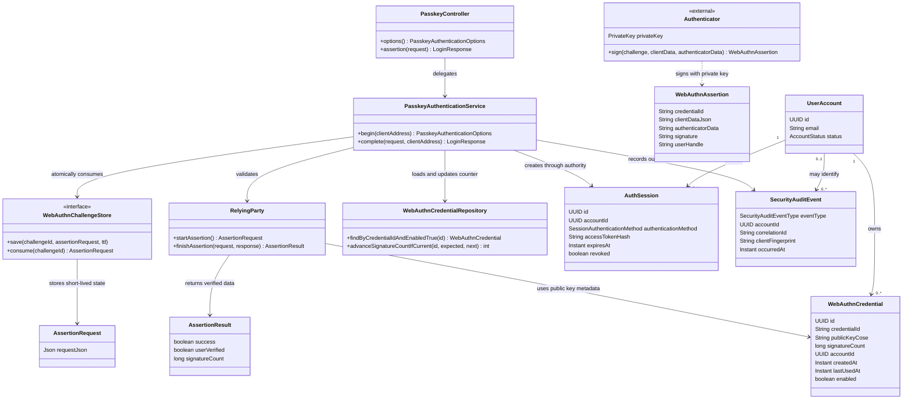
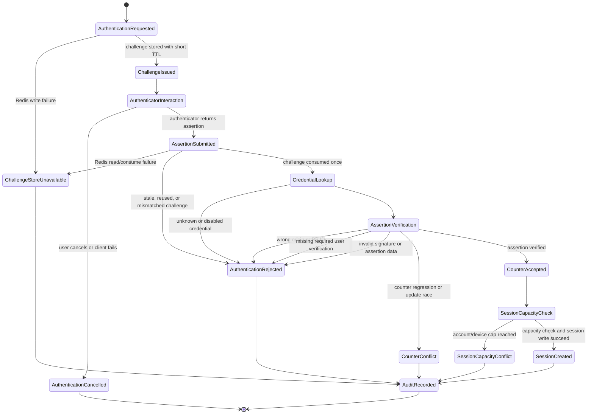

# Story 1.4 — Passkey/WebAuthn login diagrams

These are UML views for the implemented passkey authentication flow in issue #132,
aligned with [ADR-020](../adr/ADR-020-use-identity-service-for-multi-mode-authentication-and-session-management.md).
They describe the implemented `POST /api/v1/auth/passkey/options` and
`POST /api/v1/auth/passkey/assertion` operations. The identity service owns challenge policy, WebAuthn assertion verification,
credential metadata, session creation, and security auditing. The authenticator retains the private
key and only returns a signed assertion.

## Use-case view

## Sequence view

## Domain/class view

## State view

## Invariants

- The private key never leaves the platform authenticator or security key. The identity service
  stores only the credential identifier, public key, account association, enabled status, and
  authenticator metadata needed for verification.
- Every challenge is cryptographically random, short-lived, bound to the configured origin and
  relying-party id, and consumed atomically once. A Redis timeout, stale challenge, or replay fails
  closed; no local or stale fallback can create a session.
- Assertion verification must bind the client data to the consumed challenge, require the expected
  origin and RP-ID hash, enforce the configured user-verification policy, and validate the signature
  against the registered credential public key before account resolution or session creation.
- Authenticator counters are checked and advanced atomically with the credential update. A counter
  regression or concurrent compare-and-set conflict is rejected and cannot issue a session.
- A valid assertion creates a session only through the shared ADR-020 session authority, including
  the `PASSKEY` authentication method, durable session-capacity checks, and the normal token/session
  response contract.
- Rejections, dependency failures, counter conflicts, capacity conflicts, and successful logins are
  recorded as redacted security-audit outcomes. Raw challenges, assertions, signatures, public-key
  material, tokens, cookies, and network addresses are not written to logs or audit payloads.
- Credential lookup is indexed by credential ID, challenge consumption is a bounded Redis operation,
  and counter advancement is one conditional database update. The authentication path is therefore
  O(1) in the number of registered credentials for normal requests; storage and network timeouts
  remain bounded by the service's authentication dependency budgets.
